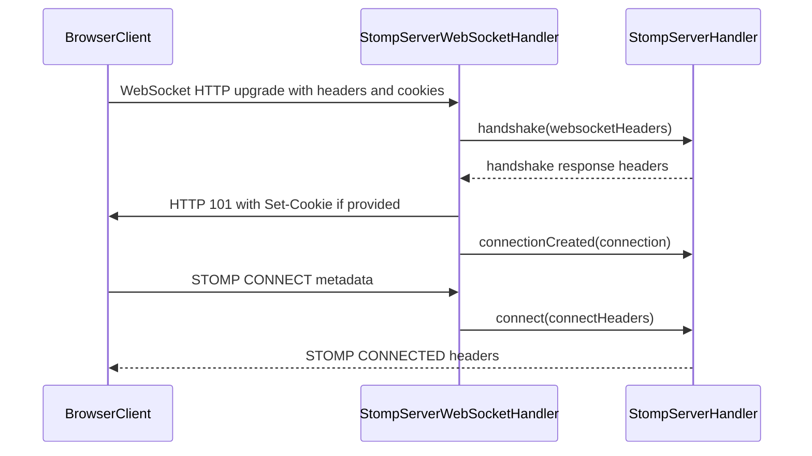
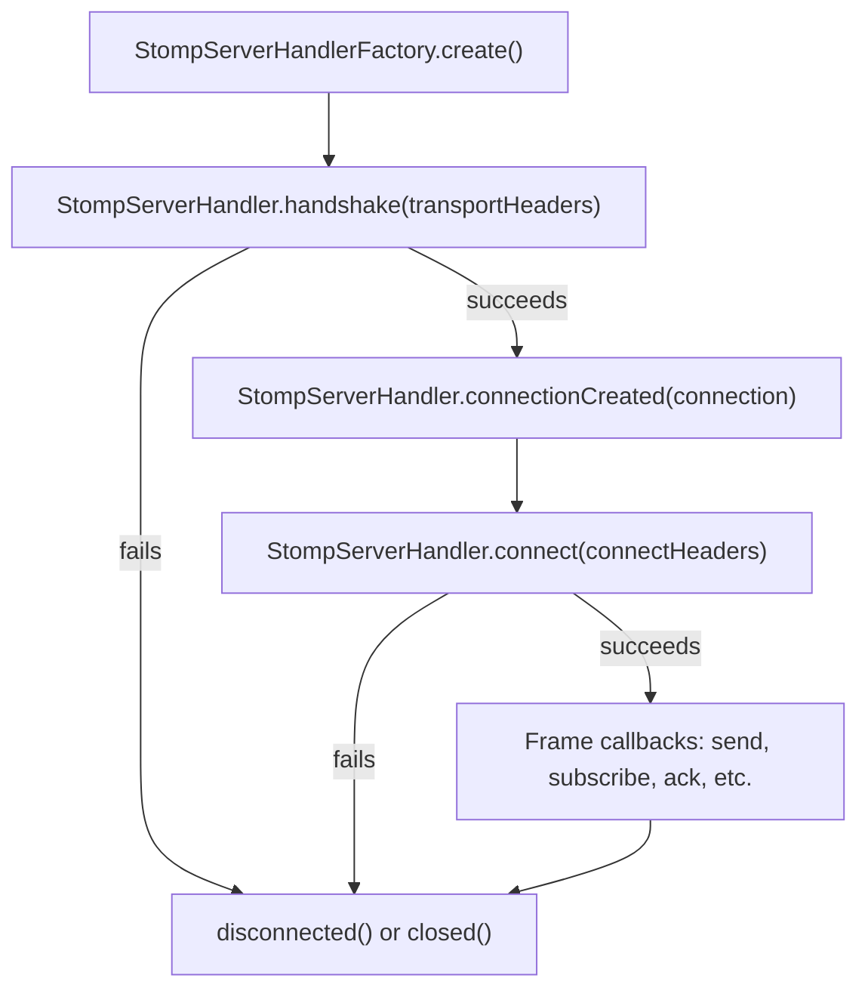

# vertx-stomp-lite
This is a simple implementation of a STOMP server that can be used with Vertx.
The method of extension is different than vertx-stomp. 

## Handshake Authentication Flow

`StompServerHandler` participates in the WebSocket HTTP handshake before the socket is accepted. Implementations can inspect the handshake headers, return HTTP response headers such as `Set-Cookie`, receive the `StompServerConnection` once it exists, and then handle the STOMP `CONNECT` frame.

## Handler Call Flow

The handler lifecycle separates transport setup, connection availability, and STOMP protocol connection.

